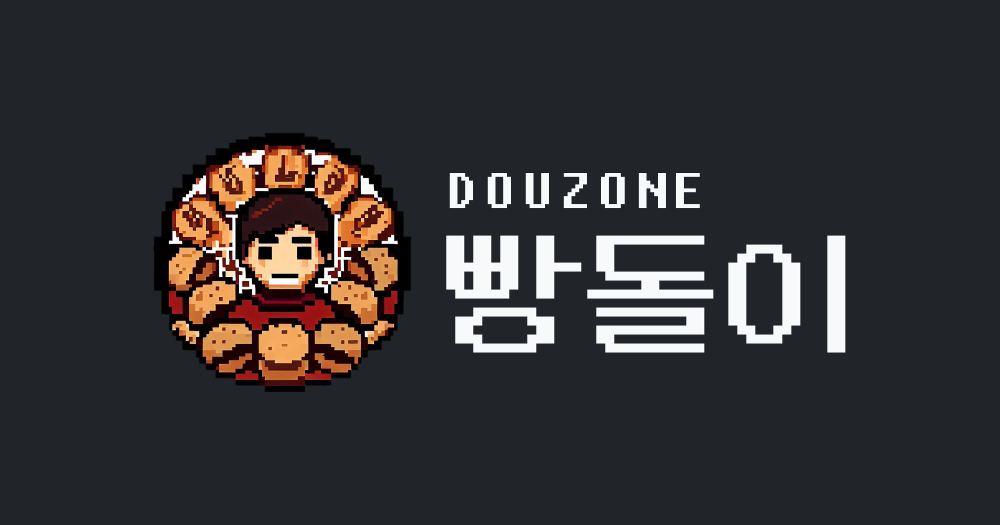

 
<!-- Index -->

Index

<ul>
    <li><a href="#overview">Overview</a></li>
    <li><a href="#introduction">Introduction</a></li>
    <li><a href="#configuration">Configuration</a></li>
    <li><a href="#roadmap">Roadmap</a></li>
    <li><a href="#stacks">Stacks</a></li>
   <li><a href="#browser-support">Browser Support</a></li>
   <li><a href="#members">Members</a></li>
</ul>

---

# Overview

- 프로젝트명 : 더존 빵돌이
- 기간 : 2023.04.04. ~
- 목표 :
- 배포주소 : https://breadkun.com/

# Introduction

# Configuration

<!--
|  |  |  |  |
| :--------------------------------------------: | :------------------------------------------------: | :------------------------------------------------------: | :--------------------------------------------------: |
|                 메인                 |                    메뉴판(Menu)                    |                   네비게이션(Slidebox)                   |                 관리자 페이지(Admin)                 | -->

# Roadmap

<!-- - [x] Web font woff
- [x] CSS reset (styled-reset)
- [x] router (react-router-dom)
- [x] Display the current page
- [x] Vertical scrolling of the digital menu
- [x] Blur effect and fixation of `<SlideBox>`
- [x] Automatically generate QR codes
- [x] 404페이지
- [ ] SEO(검색엔진최적화)
- [ ] PWA(progressive web app)
- [ ] Context API
- [ ] 최근 본 메뉴판 목록
- [ ] 웹팩
- [ ] DB, BE
- [ ] 전자메뉴판 번역기 -->

# Stacks

- Environment :    

- Developement :   

# Browser Support

  

# Members

<!-- - 홍찬기
  - github : https://github.com/coldair426
  - blog : https://velog.io/@coldair426
  - mail : coldair426@gmail.com -->

---

<!-- **Full README가 보고 싶다면 [velog](https://velog.io/@coldair426/series/%EC%8B%9D%EC%84%A0%EB%B9%84)를 참고하세요.** -->
