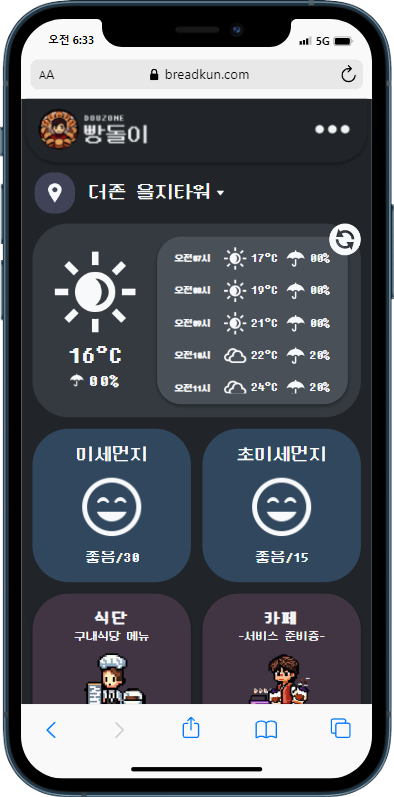
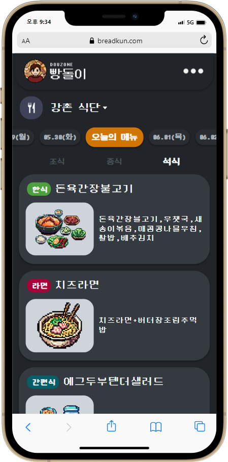
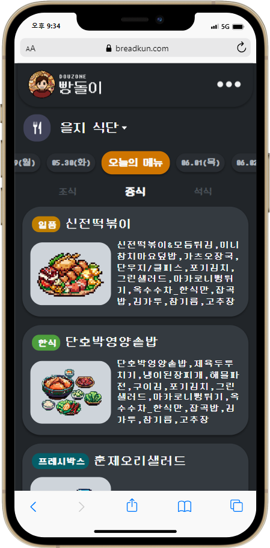
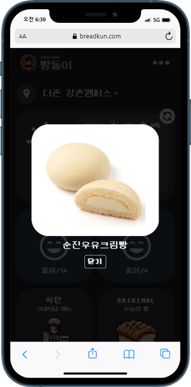
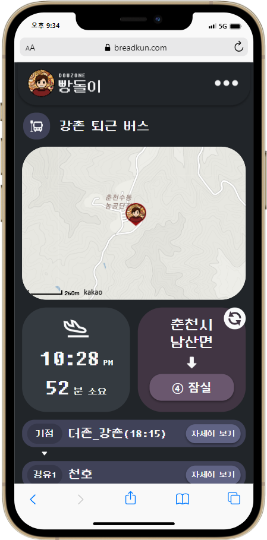
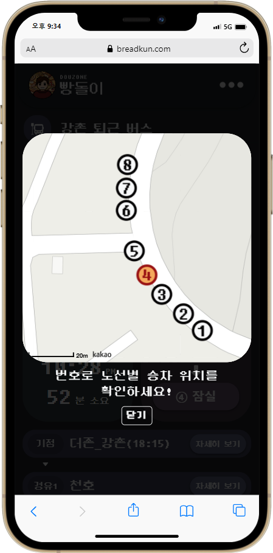
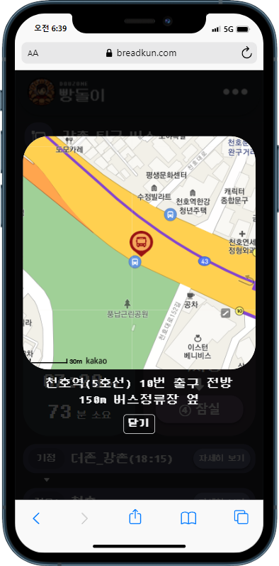
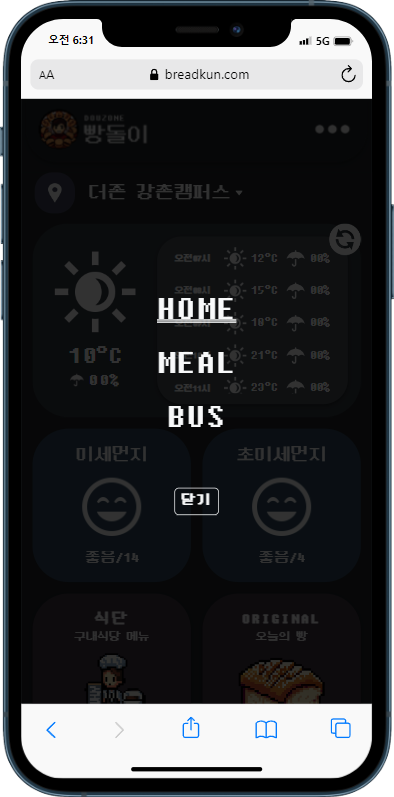
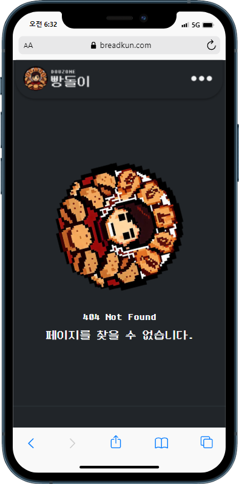

 

 
<!-- Index -->

**Index**

<ul>
    <li><a href="#overview">Overview</a></li>
    <li><a href="#introduction">Introduction</a></li>
    <li><a href="#configuration">Configuration</a></li>
    <li><a href="#roadmap">Roadmap</a></li>
    <li><a href="#stacks">Stacks</a></li>
   <li><a href="#browser-support">Browser Support</a></li>
   <li><a href="#members">Members</a></li>
</ul>

---

# Overview

- 프로젝트명 : 빵돌이(breadkun)
- 기간 : 2023.04.04. ~ 2023.05.23.
- 목표 : 더존비즈온 구내식당 식단과 통근 버스의 실시간 도착 시간을 안내하는 웹 서비스.
- 배포주소 : https://breadkun.com/

# Introduction

- 000

# Configuration

|  |  |  |  |  |
| :------------------------------------------------------: | :------------------------------------------------------: | :------------------------------------------------------: | :------------------------------------------------------: | :-----------------------------------------------------: |
|                      더존(강촌)메인                      |                      더존(을지)메인                      |                      더존(강촌)식단                      |                      더존(을지)식단                      |                      더존(강촌)빵                       |

|  |  |  |  |  |
| :---------------------------------------: | :----------------------------------------------: | :-----------------------------------------------: | :--------------------------------------------------------: | :------------------------------------------------: |
|              더존(강촌)버스               |                  더존(강촌)버스                  |                  더존(강촌)버스                   |                       네비게이션메뉴                       |                     404페이지                      |

# Roadmap

<!-- - [x] Web font woff
- [x] CSS reset (styled-reset)
- [x] router (react-router-dom)
- [x] Display the current page
- [x] Vertical scrolling of the digital menu
- [x] Blur effect and fixation of `<SlideBox>`
- [x] Automatically generate QR codes
- [x] 404페이지
- [ ] SEO(검색엔진최적화)
- [ ] PWA(progressive web app)
- [ ] Context API
- [ ] 최근 본 메뉴판 목록
- [ ] 웹팩
- [ ] DB, BE
- [ ] 전자메뉴판 번역기 -->

# Stacks

- Environment :    

- Developement :   

# Browser Support

  

# Members

- HONG(FRONT-END)
  - GitHub : https://github.com/coldair426
  - Blog : https://velog.io/@coldair426
  - Mail : coldair426@gmail.com
- PARK(BACK-END)
  - GitHub : https://github.com/pannchat
  - Blog : https://pannchat.tistory.com/

---

**Full README가 보고 싶다면 [velog](https://velog.io/@coldair426/series/breadkun)를 참고하세요.**
